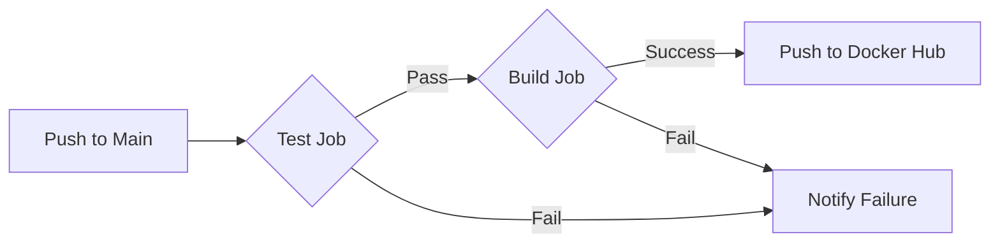

# CI/CD Pipeline Documentation

This document explains the Continuous Integration and Continuous Deployment (CI/CD) pipeline for the Crop Yield Prediction application.

## Overview

The pipeline is implemented using **GitHub Actions** and automates the following processes:
1.  **Testing**: Runs unit tests to ensure code quality.
2.  **Building**: Builds a Docker image of the API.
3.  **Deployment**: Pushes the Docker image to Docker Hub.

## Pipeline Diagram

## Workflow Structure

The workflow is defined in `.github/workflows/ci_cd.yaml` and consists of two main jobs:

### 1. Test Job (`test`)
- **Trigger**: Pushes and Pull Requests to the `main` branch.
- **Environment**: `ubuntu-latest` with Python 3.12.
- **Steps**:
    1.  Checkout code.
    2.  Install Poetry (dependency manager).
    3.  Install dependencies from `pyproject.toml` and `poetry.lock`.
    4.  Run tests using `pytest`.

### 2. Build Job (`build`)
- **Trigger**: Pushes to the `main` branch (only runs if `test` job passes).
- **Environment**: `ubuntu-latest`.
- **Steps**:
    1.  Checkout code.
    2.  Login to Docker Hub using secrets.
    3.  Build the Docker image `crop-yield-prediction`.
    4.  Push the image to Docker Hub with `latest` and commit SHA tags.

## Configuration & Secrets

To enable the pipeline, you must configure the following **Repository Secrets** in GitHub:

| Secret Name | Description |
| :--- | :--- |
| `DOCKER_USERNAME` | Your Docker Hub username. |
| `DOCKER_PASSWORD` | Your Docker Hub password or access token. |

## Streamlit Deployment

The Streamlit application is deployed separately via **Streamlit Community Cloud**.
- **Setup**: Connect your GitHub repository to Streamlit Community Cloud.
- **Trigger**: Automatic deployment on push to `main`.
- **Configuration**: Ensure `pyproject.toml` is present for dependency installation.

## Status Badges

You can view the status of the pipeline in the `README.md` file.
