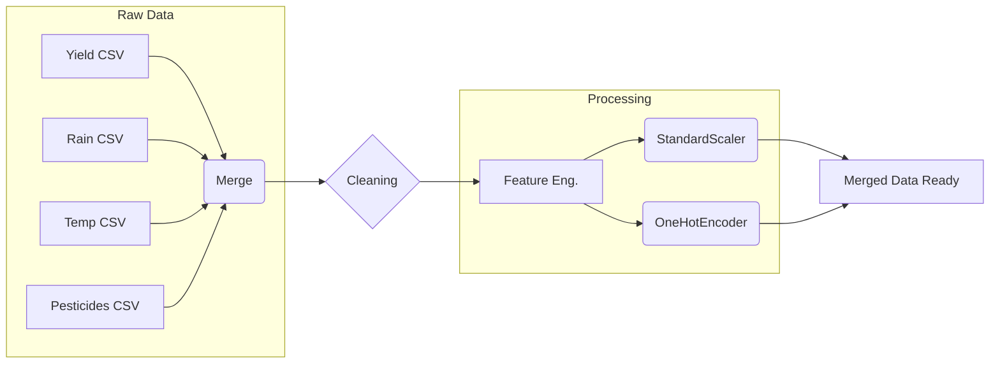
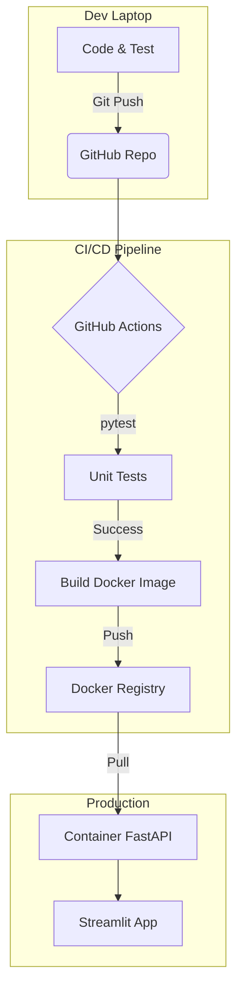

# Diagrammes du Projet

Copiez-collez ces codes dans un éditeur Mermaid (ex: [Mermaid Live Editor](https://mermaid.live/)) pour générer les images pour vos slides.

## 1. Slide 6 : Pipeline de Données (ETL)

## 2. Slide 12 : Architecture MLOps (End-to-End)

